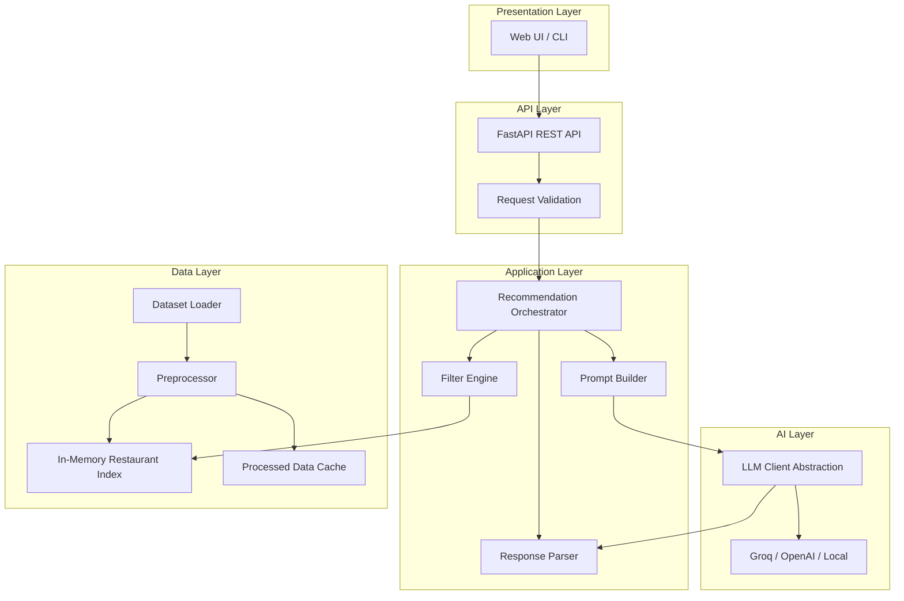
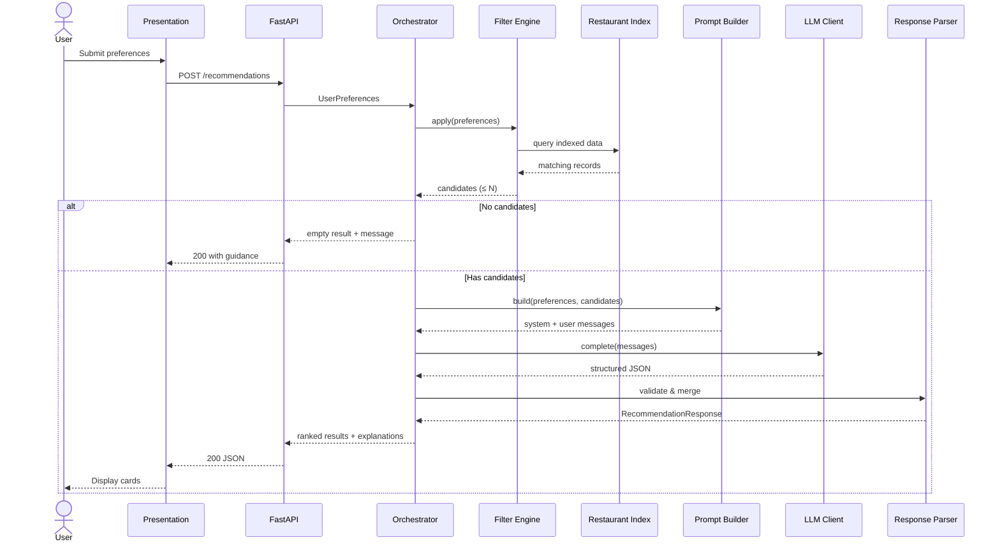
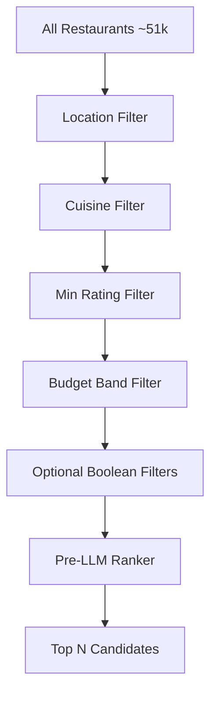
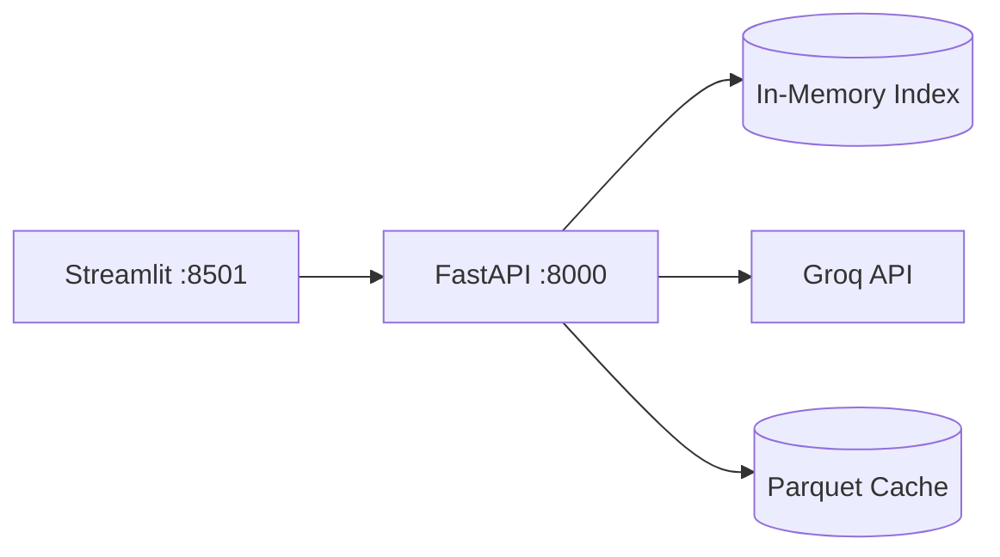

# Architecture: Zomato AI Restaurant Recommendation System

This document defines the detailed system architecture for the project described in [problemStatement.md](./problemStatement.md). It covers component design, data flow, interfaces, and implementation conventions.

---

## 1. Architecture Overview

The system follows a **layered, pipeline architecture** with a clear separation between data, business logic, AI reasoning, and presentation. Structured filtering runs deterministically before any LLM call so recommendations stay grounded in the dataset.

### 1.1 Design Principles

| Principle | Rationale |
|-----------|-----------|
| **Grounded recommendations** | The LLM only ranks and explains restaurants already present in the filtered candidate set—never invents listings. |
| **Filter first, reason second** | Hard constraints (location, cuisine, budget, rating) are enforced in code; the LLM handles soft preferences and trade-offs. |
| **Bounded LLM input** | Candidate sets are capped (e.g., 15–25 restaurants) to respect context limits, cost, and latency. |
| **Single source of truth** | All factual fields (name, rating, cost) come from preprocessed dataset records, not from LLM output. |
| **Provider-agnostic LLM** | LLM access is abstracted behind an interface so Groq, OpenAI, or local models can be swapped. |
| **Fail gracefully** | Empty filter results, LLM timeouts, and malformed responses degrade to structured fallbacks—not crashes. |

### 1.2 High-Level System Diagram



### 1.3 Request Lifecycle



---

## 2. Technology Stack

| Layer | Choice | Notes |
|-------|--------|-------|
| Language | Python 3.11+ | Ecosystem fit for data + LLM tooling |
| Data loading | `datasets` (Hugging Face) | Loads `ManikaSaini/zomato-restaurant-recommendation` |
| Data processing | `pandas`, `numpy` | Cleaning, normalization, indexing |
| API | FastAPI + Pydantic v2 | Typed request/response models, OpenAPI docs |
| LLM | Groq client | Default: llama-3.3-70b-versatile or similar; abstracted |
| UI | Streamlit (v1) | Fast iteration; can migrate to React later |
| Config | `pydantic-settings` + `.env` | API keys, model name, candidate limits |
| Logging | `structlog` or stdlib `logging` | Structured logs for filter counts, LLM latency |
| Testing | `pytest` | Unit tests for filter/preprocess; mocked LLM integration tests |

---

## 3. Project Structure

```
Zomato/
├── docs/
│   ├── problemStatement.md
│   └── architecture.md
├── src/
│   └── zomato_rec/
│       ├── __init__.py
│       ├── main.py                 # FastAPI app entrypoint
│       ├── config.py               # Settings from env
│       ├── models/
│       │   ├── preferences.py      # UserPreferences schema
│       │   ├── restaurant.py       # RestaurantRecord schema
│       │   └── recommendation.py   # RecommendationResponse schema
│       ├── data/
│       │   ├── loader.py           # Hugging Face dataset load
│       │   ├── preprocessor.py     # Clean & normalize fields
│       │   └── index.py            # In-memory query index
│       ├── filtering/
│       │   ├── engine.py           # Orchestrates filter pipeline
│       │   ├── hard_filters.py     # Location, cuisine, rating, budget
│       │   └── ranker.py           # Pre-LLM sort (rating, votes)
│       ├── llm/
│       │   ├── client.py           # Abstract LLM interface
│       │   ├── groq_client.py      # Groq implementation
│       │   ├── prompts.py          # System/user prompt templates
│       │   └── parser.py           # Parse & validate LLM JSON
│       ├── services/
│       │   └── recommendation.py   # Orchestrator: filter → LLM → response
│       └── api/
│           ├── routes.py             # /recommendations, /health, /metadata
│           └── dependencies.py       # DI: get index, get orchestrator
├── ui/
│   └── streamlit_app.py            # Streamlit frontend
├── tests/
│   ├── unit/
│   │   ├── test_preprocessor.py
│   │   ├── test_filters.py
│   │   └── test_parser.py
│   └── integration/
│       └── test_recommendation_flow.py
├── data/
│   └── processed/                  # Cached parquet (gitignored)
├── .env.example
├── pyproject.toml
└── README.md
```

---

## 4. Component Design

### 4.1 Data Layer

#### 4.1.1 Dataset Loader (`data/loader.py`)

**Responsibility:** Fetch the Hugging Face dataset once at startup (or on first request) and expose raw records.

```python
def load_raw_dataset() -> pd.DataFrame:
    """Load ManikaSaini/zomato-restaurant-recommendation split='train'."""
```

**Behavior:**
- Uses `datasets.load_dataset("ManikaSaini/zomato-restaurant-recommendation", split="train")`.
- Converts to pandas DataFrame for preprocessing.
- Logs row count and load time.

#### 4.1.2 Preprocessor (`data/preprocessor.py`)

**Responsibility:** Transform raw strings into typed, queryable fields.

| Raw Field | Normalized Field | Transformation |
|-----------|------------------|----------------|
| `rate` | `rating: float \| None` | Strip `/5`, parse float; `None` if missing or `"-"` |
| `approx_cost(for two people)` | `cost_for_two: int \| None` | Strip commas, parse int |
| `cuisines` | `cuisines: list[str]` | Split on `,`, strip, lowercase for matching |
| `location` | `location: str` | Strip whitespace; canonical case for display |
| `online_order` | `online_order: bool` | `"Yes"` → `True` |
| `book_table` | `book_table: bool` | `"Yes"` → `True` |
| `reviews_list` | `review_snippets: list[str]` | Parse tuples; keep top 2–3 short snippets for LLM context |
| `dish_liked` | `popular_dishes: list[str]` | Split on `,` |
| — | `restaurant_id: str` | Hash of `url` or row index for stable LLM references |

**Output:** `RestaurantRecord` objects stored in a normalized DataFrame and serialized to `data/processed/restaurants.parquet` for fast restarts.

#### 4.1.3 Restaurant Index (`data/index.py`)

**Responsibility:** Provide fast lookup and metadata for the UI/API.

**Indexed metadata (for dropdowns):**
- Unique `location` values (93 neighborhoods)
- Unique `cuisines` (flattened, deduplicated)
- Cost percentiles for budget band mapping (low ≤ p33, medium p33–p66, high > p66)
- `listed_in(type)` categories

**Query interface:**

```python
class RestaurantIndex:
    def get_all(self) -> list[RestaurantRecord]: ...
    def get_locations(self) -> list[str]: ...
    def get_cuisines(self) -> list[str]: ...
    def get_budget_ranges(self) -> dict[str, tuple[int, int]]: ...
```

---

### 4.2 Filtering Layer

#### 4.2.1 Filter Engine (`filtering/engine.py`)

**Responsibility:** Apply hard filters, then reduce to a bounded candidate set for the LLM.

**Pipeline (sequential, short-circuit on empty):**



| Filter | Type | Logic |
|--------|------|-------|
| Location | Hard | Exact or case-insensitive match on `location` |
| Cuisine | Hard | User cuisine in `restaurant.cuisines` (substring match) |
| Min rating | Hard | `rating >= min_rating`; exclude `None` if threshold set |
| Budget | Hard | Map low/medium/high to cost percentiles; filter by range |
| Online order | Optional hard | `online_order == True` if requested |
| Book table | Optional hard | `book_table == True` if requested |

**Candidate cap:** After hard filters, sort by `(rating DESC, votes DESC)` and take top **N = 20** (configurable via `MAX_CANDIDATES`).

**Empty results:** Return structured message suggesting relaxed filters (e.g., lower min rating, broader location).

#### 4.2.2 Pre-LLM Ranker (`filtering/ranker.py`)

A lightweight deterministic sort before LLM—does not replace LLM ranking but ensures the best factual candidates are in the prompt when filters return more than N rows.

---

### 4.3 AI Layer

#### 4.3.1 LLM Client Abstraction (`llm/client.py`)

```python
class LLMClient(Protocol):
    async def complete(
        self,
        messages: list[dict[str, str]],
        *,
        response_format: dict | None = None,
    ) -> str: ...
```

Implementations: `GroqClient`, optionally `OpenAIClient`. Selected via config.

#### 4.3.2 Prompt Design (`llm/prompts.py`)

**System prompt goals:**
- Act as a restaurant recommendation assistant for Bangalore.
- Rank only from the provided candidate list.
- Never invent restaurants or alter factual fields.
- Output valid JSON matching the response schema.
- Acknowledge trade-offs when soft preferences conflict.

**User prompt structure:**

```
USER PREFERENCES:
- Location: {location}
- Cuisine: {cuisine}
- Budget: {budget} ({cost_range})
- Minimum rating: {min_rating}
- Additional: {additional_preferences}

CANDIDATES (reference by restaurant_id):
[
  {
    "id": "abc123",
    "name": "...",
    "location": "...",
    "cuisines": [...],
    "rating": 4.2,
    "votes": 890,
    "cost_for_two": 800,
    "rest_type": "...",
    "popular_dishes": [...],
    "online_order": true,
    "book_table": false,
    "review_snippets": ["...", "..."]
  },
  ...
]

Return top 5 recommendations as JSON.
```

#### 4.3.3 Expected LLM Response Schema

```json
{
  "summary": "Brief overview of how these picks fit the user's request.",
  "recommendations": [
    {
      "restaurant_id": "abc123",
      "rank": 1,
      "explanation": "Strong match for Italian in Indiranagar with a 4.5 rating and mid-range pricing.",
      "highlights": ["High rating", "Matches cuisine", "Within budget"]
    }
  ],
  "relaxation_note": "Optional note if no perfect match exists."
}
```

#### 4.3.4 Response Parser (`llm/parser.py`)

**Responsibility:** Validate LLM JSON and merge with ground-truth dataset fields.

**Validation rules:**
1. Every `restaurant_id` must exist in the candidate set.
2. Drop duplicate ranks; enforce max 5 recommendations.
3. Factual display fields (`name`, `rating`, `cost_for_two`, etc.) are **always** taken from `RestaurantRecord`, never from LLM text.
4. On parse failure: retry once with a repair prompt; if still failing, fall back to deterministic top-5 from pre-LLM ranker with generic explanations.

---

### 4.4 Application Layer

#### 4.4.1 Recommendation Orchestrator (`services/recommendation.py`)

Central coordinator for the end-to-end flow:

```python
class RecommendationService:
    async def recommend(self, preferences: UserPreferences) -> RecommendationResponse:
        candidates = self.filter_engine.apply(preferences)
        if not candidates:
            return RecommendationResponse.empty(preferences)

        messages = self.prompt_builder.build(preferences, candidates)
        raw = await self.llm_client.complete(messages, response_format=JSON_SCHEMA)
        return self.parser.parse_and_merge(raw, candidates)
```

**Startup lifecycle:**
1. Load or build processed dataset.
2. Initialize `RestaurantIndex` (singleton, held in memory).
3. Warm up LLM client connection.

---

### 4.5 API Layer

#### 4.5.1 Endpoints

| Method | Path | Description |
|--------|------|-------------|
| `GET` | `/health` | Liveness check |
| `GET` | `/metadata/locations` | List valid Bangalore neighborhoods |
| `GET` | `/metadata/cuisines` | List available cuisines |
| `GET` | `/metadata/budget-bands` | Return cost ranges for low/medium/high |
| `POST` | `/recommendations` | Main recommendation endpoint |

#### 4.5.2 Request Schema — `UserPreferences`

```python
class UserPreferences(BaseModel):
    location: str
    cuisine: str
    budget: Literal["low", "medium", "high"]
    min_rating: float = Field(ge=0, le=5, default=3.5)
    additional_preferences: str | None = None
    online_order: bool | None = None
    book_table: bool | None = None
    max_results: int = Field(default=5, ge=1, le=10)
```

#### 4.5.3 Response Schema — `RecommendationResponse`

```python
class RecommendationItem(BaseModel):
    rank: int
    restaurant_id: str
    name: str
    location: str
    cuisines: list[str]
    rating: float | None
    votes: int
    cost_for_two: int | None
    rest_type: str | None
    online_order: bool
    book_table: bool
    explanation: str
    highlights: list[str]

class RecommendationResponse(BaseModel):
    summary: str
    recommendations: list[RecommendationItem]
    filters_applied: dict[str, Any]
    candidate_count: int
    relaxation_note: str | None = None
```

#### 4.5.4 Error Handling

| Scenario | HTTP | Response |
|----------|------|----------|
| Invalid input | 422 | Pydantic validation errors |
| Unknown location | 422 | Suggest closest matches from index |
| No candidates | 200 | Empty list + `relaxation_note` |
| LLM timeout | 504 | Fallback to deterministic ranking |
| LLM parse failure | 200 | Fallback ranking with warning flag |

---

### 4.6 Presentation Layer

#### 4.6.1 Streamlit UI (`ui/streamlit_app.py`)

**Pages / sections:**
1. **Preference form** — dropdowns populated from `/metadata/*` endpoints.
2. **Results view** — recommendation cards with rating, cost, explanation.
3. **Empty state** — guidance to relax filters.

**Layout per recommendation card:**
- Rank badge
- Name + location
- Star rating + votes
- Cost for two
- Cuisine tags
- AI explanation
- Optional: popular dishes

The UI calls the FastAPI backend; it does not embed business logic directly.

---

## 5. Data Models

### 5.1 Core Domain Models

```python
@dataclass
class RestaurantRecord:
    restaurant_id: str
    name: str
    location: str
    address: str
    cuisines: list[str]
    rating: float | None
    votes: int
    cost_for_two: int | None
    rest_type: str | None
    popular_dishes: list[str]
    online_order: bool
    book_table: bool
    listed_in_type: str | None
    review_snippets: list[str]
    url: str
```

### 5.2 Budget Band Mapping

Computed once at preprocessing from cost distribution:

| Band | Rule (example) |
|------|------------------|
| Low | `cost_for_two <= percentile_33` |
| Medium | `percentile_33 < cost_for_two <= percentile_66` |
| High | `cost_for_two > percentile_66` |

Restaurants with missing cost are excluded from budget-filtered results unless no cost filter is applied.

---

## 6. Configuration

Environment variables (`.env`):

```bash
# LLM
LLM_PROVIDER=groq
GROQ_API_KEY=gsk-...
LLM_MODEL=llama-3.3-70b-versatile
LLM_TIMEOUT_SECONDS=30
LLM_MAX_RETRIES=1

# Pipeline
MAX_CANDIDATES=20
MAX_RESULTS=5
DATA_CACHE_PATH=data/processed/restaurants.parquet

# API
API_HOST=0.0.0.0
API_PORT=8000
```

---

## 7. Cross-Cutting Concerns

### 7.1 Grounding & Hallucination Prevention

| Control | Implementation |
|---------|----------------|
| Closed candidate set | LLM prompt lists only filtered restaurants with IDs |
| ID-based references | LLM returns `restaurant_id`; parser resolves facts from index |
| Schema validation | Pydantic rejects unknown IDs |
| Fact override | Display fields always sourced from dataset, not LLM prose |
| Fallback path | Deterministic ranking if LLM output is invalid |

### 7.2 Performance

| Stage | Target | Strategy |
|-------|--------|----------|
| Dataset load (cold) | < 30s | Parquet cache after first preprocess |
| Dataset load (warm) | < 2s | Load from `data/processed/` |
| Filter pipeline | < 100ms | In-memory pandas/numpy on ~52k rows |
| LLM call | 2–8s | Small model, compact candidate JSON, streaming optional |
| End-to-end | < 10s | Async API; UI loading state |

### 7.3 Observability

Log at each stage:
- `filter.input_count`, `filter.output_count`
- `llm.latency_ms`, `llm.token_estimate`
- `parser.fallback_used` (boolean)
- `recommendation.request_id`

### 7.4 Security

- API keys only in environment variables, never committed.
- No user PII collected in v1.
- Rate limiting on `/recommendations` (optional, e.g., slowapi) if deployed publicly.
- Input sanitization on `additional_preferences` to limit prompt injection length (max 500 chars).

---

## 8. Deployment Architecture

### 8.1 Local Development



**Run order:**
1. Start FastAPI: `uvicorn zomato_rec.main:app --reload`
2. Start Streamlit: `streamlit run ui/streamlit_app.py`

### 8.2 Production (Future)

| Component | Suggestion |
|-----------|------------|
| API | Docker container on Railway / Render / AWS ECS |
| UI | Streamlit Cloud or static frontend + API |
| Secrets | Platform secret manager |
| Cache | Pre-bake parquet into Docker image or S3 |

No database required for v1—the full dataset fits in memory (~52k rows).

---

## 9. Testing Strategy

| Layer | Test Type | Focus |
|-------|-----------|-------|
| Preprocessor | Unit | Rating/cost parsing edge cases (`"-"`, `"4.1/5"`, `"1,200"`) |
| Hard filters | Unit | Location, cuisine, budget, rating combinations |
| Ranker | Unit | Correct top-N selection by rating/votes |
| Prompt builder | Unit | Snapshot of prompt structure |
| Parser | Unit | Valid JSON, invalid IDs, missing fields |
| Orchestrator | Integration | Mocked LLM; full pipeline |
| API | Integration | `/recommendations` with TestClient |

**Fixtures:** Small CSV subset (10–20 rows) covering edge cases for fast tests.

---

## 10. Implementation Phases

See **[implementationPlan.md](./implementationPlan.md)** for the full phase-wise plan with tasks, acceptance criteria, tests, and verification steps.

| Phase | Deliverable | Depends On |
|-------|-------------|------------|
| **Phase 0 — Setup** | Project skeleton, config, dependencies | — |
| **Phase 1 — Data** | Loader, preprocessor, parquet cache, index | Phase 0 |
| **Phase 2 — Filter** | Hard filters, ranker, metadata endpoints | Phase 1 |
| **Phase 3 — LLM** | Prompts, client, parser, fallback | Phase 2 |
| **Phase 4 — API** | FastAPI routes, orchestrator, error handling | Phase 3 |
| **Phase 5 — UI** | Streamlit app wired to API | Phase 4 |
| **Phase 6 — Quality** | Tests, logging, `.env.example`, README | Phase 5 |

---

## 11. Future Extensions (Out of Scope for v1)

| Extension | Architectural Impact |
|-----------|---------------------|
| Vector search on reviews | Add embedding index (e.g., Chroma) between filter and LLM |
| Multi-turn chat | Session store + conversation history in orchestrator |
| User accounts | Auth middleware + preference history DB |
| Live Zomato data | Replace static loader with external API adapter |
| React frontend | Replace Streamlit; API layer unchanged |
| Local LLM (Ollama) | New `LLMClient` implementation |

---

## 12. Architecture Decision Records (Summary)

| Decision | Choice | Alternatives Considered | Reason |
|----------|--------|-------------------------|--------|
| Filter before LLM | Yes | LLM-only retrieval | Grounding, cost, latency |
| In-memory index | Yes | PostgreSQL / Elasticsearch | Dataset size (~52k) fits RAM; simpler ops |
| FastAPI + Streamlit | Yes | Django, Gradio | Typed API + rapid UI iteration |
| JSON-mode LLM output | Yes | Free-text parsing | Reliable structured parsing |
| Fact merge in parser | Yes | Trust LLM for all fields | Prevents hallucinated ratings/costs |
| Bangalore-only | Yes | Multi-city abstraction | Matches dataset scope |

---

## 13. Related Documents

- [problemStatement.md](./problemStatement.md) — problem definition, data source, success criteria
- [implementationPlan.md](./implementationPlan.md) — phase-wise tasks, acceptance criteria, timeline
- [edgecase.md](./edgecase.md) — edge cases by layer and phase
- [eval/](./eval/) — phase evaluation criteria (`phase0-eval.md` … `phase6-eval.md`)
- `README.md` (to be added) — setup and run instructions
