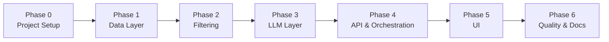

# Phase-Wise Implementation Plan

This document is the execution roadmap for the **Zomato AI Restaurant Recommendation System**. It translates the goals in [problemStatement.md](./problemStatement.md) and the design in [architecture.md](./architecture.md) into concrete, verifiable phases.

---

## Overview

### Goal

Deliver a working end-to-end application that accepts user preferences, filters ~52k Bangalore restaurants, uses an LLM to rank and explain top picks, and displays results in a Streamlit UI backed by a FastAPI API.

### Phase Map



| Phase | Name | Primary Output | Depends On |
|-------|------|----------------|------------|
| 0 | Project Setup | Runnable Python project skeleton | — |
| 1 | Data Layer | Loaded, cleaned, cached restaurant index | Phase 0 |
| 2 | Filtering | Deterministic candidate selection | Phase 1 |
| 3 | LLM Layer | Prompting, ranking, explanations, fallback | Phase 2 |
| 4 | API & Orchestration | FastAPI service with full pipeline | Phase 3 |
| 5 | UI | Streamlit frontend | Phase 4 |
| 6 | Quality & Docs | Tests, logging, README, polish | Phase 5 |

### Estimated Timeline

Assumes one developer working sequentially. Adjust if parallelizing.

| Phase | Estimate | Cumulative |
|-------|----------|------------|
| Phase 0 | 0.5 day | 0.5 day |
| Phase 1 | 1–2 days | 2.5 days |
| Phase 2 | 1 day | 3.5 days |
| Phase 3 | 1.5–2 days | 5.5 days |
| Phase 4 | 1 day | 6.5 days |
| Phase 5 | 1 day | 7.5 days |
| Phase 6 | 1–1.5 days | **~9 days** |

---

## Phase 0 — Project Setup

**Objective:** Establish the repository structure, dependencies, and configuration so later phases can be built incrementally.

### Tasks

| # | Task | Details |
|---|------|---------|
| 0.1 | Initialize Python project | Create `pyproject.toml` with package metadata and dependencies |
| 0.2 | Scaffold directory layout | Match structure in [architecture.md §3](./architecture.md#3-project-structure) |
| 0.3 | Add configuration module | `src/zomato_rec/config.py` using `pydantic-settings` |
| 0.4 | Add environment template | `.env.example` with LLM, pipeline, and API vars |
| 0.5 | Add `.gitignore` | Ignore `.env`, `data/processed/`, `__pycache__`, `.venv` |
| 0.6 | Define domain model stubs | Empty Pydantic/dataclass files under `models/` |

### Files to Create

```
pyproject.toml
.env.example
.gitignore
src/zomato_rec/__init__.py
src/zomato_rec/config.py
src/zomato_rec/models/preferences.py
src/zomato_rec/models/restaurant.py
src/zomato_rec/models/recommendation.py
data/processed/.gitkeep
tests/conftest.py
```

### Dependencies (initial)

```
python = ">=3.11"
pandas
numpy
datasets
fastapi
uvicorn[standard]
pydantic
pydantic-settings
httpx
groq
streamlit
pytest
pytest-asyncio
```

### Acceptance Criteria

- [ ] `pip install -e ".[dev]"` (or equivalent) succeeds in a fresh virtualenv
- [ ] `from zomato_rec.config import Settings` loads without error
- [ ] Project structure matches architecture doc
- [ ] Secrets are not committed; `.env.example` documents all required vars

### Verification

```bash
python -c "from zomato_rec.config import Settings; print(Settings())"
pytest --collect-only   # discovers test package (may have 0 tests)
```

---

## Phase 1 — Data Layer

**Objective:** Load the Hugging Face dataset, normalize fields, cache processed data, and expose an in-memory restaurant index.

**Maps to problem statement:** Data Ingestion; success criterion #1 (accurate filtering requires clean data).

### Tasks

| # | Task | Module | Details |
|---|------|--------|---------|
| 1.1 | Implement dataset loader | `data/loader.py` | Load `ManikaSaini/zomato-restaurant-recommendation`, split `train` |
| 1.2 | Implement field normalizers | `data/preprocessor.py` | Parse rating, cost, cuisines, booleans, review snippets |
| 1.3 | Generate stable IDs | `data/preprocessor.py` | Hash `url` → `restaurant_id` |
| 1.4 | Build parquet cache | `data/preprocessor.py` | Write/read `data/processed/restaurants.parquet` |
| 1.5 | Implement `RestaurantRecord` | `models/restaurant.py` | Typed model matching architecture §5.1 |
| 1.6 | Implement `RestaurantIndex` | `data/index.py` | `get_all`, `get_locations`, `get_cuisines`, `get_budget_ranges` |
| 1.7 | Compute budget percentiles | `data/index.py` | p33 / p66 for low / medium / high bands |
| 1.8 | Add startup bootstrap | `data/index.py` or `main.py` helper | Load cache if exists; else download + preprocess |

### Field Normalization Checklist

| Raw Field | Target | Edge Cases to Handle |
|-----------|--------|----------------------|
| `rate` | `float \| None` | `"-"`, empty, `"4.1/5"`, `"NEW"` |
| `approx_cost(for two people)` | `int \| None` | `"1,200"`, non-numeric |
| `cuisines` | `list[str]` | Empty, single cuisine, mixed casing |
| `online_order` / `book_table` | `bool` | `"Yes"` / `"No"` / missing |
| `reviews_list` | `list[str]` | Long strings; keep 2–3 short snippets |
| `dish_liked` | `list[str]` | Comma-separated, missing |

### Acceptance Criteria

- [ ] Cold start: dataset downloads and preprocesses ~51,717 rows successfully
- [ ] Warm start: loads from parquet in < 2 seconds
- [ ] `get_locations()` returns ~93 unique Bangalore neighborhoods
- [ ] `get_cuisines()` returns deduplicated cuisine list
- [ ] `get_budget_ranges()` returns valid `(min, max)` tuples for low/medium/high
- [ ] No crashes on missing `rate` or `cost_for_two` values
- [ ] Parquet cache is written and reused on subsequent runs

### Verification

```bash
python -m zomato_rec.data.preprocessor   # optional CLI entry if added
pytest tests/unit/test_preprocessor.py -v
```

### Unit Tests (`tests/unit/test_preprocessor.py`)

- Rating parse: `"4.5/5"` → `4.5`, `"-"` → `None`
- Cost parse: `"1,200"` → `1200`
- Cuisine split: `"North Indian, Chinese"` → `["north indian", "chinese"]`
- Boolean: `"Yes"` → `True`, `"No"` → `False`

---

## Phase 2 — Filtering Layer

**Objective:** Apply hard filters on user preferences and return a bounded, ranked candidate set for the LLM.

**Maps to problem statement:** Integration Layer (structured filter); success criterion #1 (filter accurately).

### Tasks

| # | Task | Module | Details |
|---|------|--------|---------|
| 2.1 | Define `UserPreferences` model | `models/preferences.py` | Fields per architecture §4.5.2 |
| 2.2 | Location filter | `filtering/hard_filters.py` | Case-insensitive exact match on `location` |
| 2.3 | Cuisine filter | `filtering/hard_filters.py` | Substring match in normalized cuisine list |
| 2.4 | Min rating filter | `filtering/hard_filters.py` | Exclude `None` ratings when threshold set |
| 2.5 | Budget filter | `filtering/hard_filters.py` | Map band to percentile range from index |
| 2.6 | Optional boolean filters | `filtering/hard_filters.py` | `online_order`, `book_table` when requested |
| 2.7 | Pre-LLM ranker | `filtering/ranker.py` | Sort by `(rating DESC, votes DESC)` |
| 2.8 | Filter engine | `filtering/engine.py` | Chain filters; cap at `MAX_CANDIDATES` (default 20) |
| 2.9 | Empty-result messaging | `filtering/engine.py` | Return `relaxation_note` with suggestions |

### Filter Pipeline

```
All (~51k) → location → cuisine → min_rating → budget → booleans → rank → top N
```

### Acceptance Criteria

- [ ] Location filter returns only restaurants in the requested neighborhood
- [ ] Cuisine filter matches partial cuisine names (e.g., `"Indian"` matches `"North Indian"`)
- [ ] Budget filter respects computed percentile bands
- [ ] Candidate set never exceeds `MAX_CANDIDATES`
- [ ] Empty filter result includes actionable `relaxation_note`
- [ ] Filter pipeline completes in < 100ms on full index

### Verification

```bash
pytest tests/unit/test_filters.py -v
```

### Unit Tests (`tests/unit/test_filters.py`)

| Scenario | Expected |
|----------|----------|
| Location = `"Indiranagar"` | All results in Indiranagar |
| Cuisine = `"Chinese"` + location | Intersection only |
| `min_rating = 4.5` | No restaurant below 4.5 |
| Budget = `"low"` | All within low band range |
| Overly strict combo | Empty list + relaxation note |
| 500+ matches | Exactly `MAX_CANDIDATES` returned, highest rated first |

### Manual Smoke Test

```python
from zomato_rec.data.index import build_index
from zomato_rec.filtering.engine import FilterEngine
from zomato_rec.models.preferences import UserPreferences

index = build_index()
engine = FilterEngine(index)
prefs = UserPreferences(location="Koramangala", cuisine="North Indian", budget="medium", min_rating=4.0)
candidates = engine.apply(prefs)
print(len(candidates), candidates[0].name)
```

---

## Phase 3 — LLM Layer

**Objective:** Build prompts, call the LLM, parse structured JSON, merge ground-truth facts, and fall back gracefully on failure.

**Maps to problem statement:** Recommendation Engine; success criteria #2–4 (meaningful, clear, grounded).

### Tasks

| # | Task | Module | Details |
|---|------|--------|---------|
| 3.1 | LLM client protocol | `llm/client.py` | `async complete(messages, response_format)` |
| 3.2 | Groq implementation | `llm/groq_client.py` | JSON mode, timeout, retry |
| 3.3 | System prompt | `llm/prompts.py` | Grounding rules, Bangalore scope, JSON-only output |
| 3.4 | User prompt builder | `llm/prompts.py` | Preferences + compact candidate JSON |
| 3.5 | Response JSON schema | `llm/prompts.py` | Match architecture §4.3.3 |
| 3.6 | Response parser | `llm/parser.py` | Validate IDs, merge facts from `RestaurantRecord` |
| 3.7 | Fallback path | `llm/parser.py` | Deterministic top-N + generic explanations on failure |
| 3.8 | Repair retry | `llm/parser.py` | One retry with repair prompt on invalid JSON |
| 3.9 | Mock LLM for tests | `tests/conftest.py` | Fixture returning valid/invalid JSON |

### Prompt Content Requirements

**System prompt must enforce:**
- Rank only from provided `restaurant_id` list
- Never invent restaurants or modify factual fields
- Return valid JSON only
- Acknowledge trade-offs for soft preferences (`additional_preferences`)

**User prompt must include:**
- All hard preference fields
- Budget as band + numeric range
- Up to 20 candidates with id, name, rating, votes, cost, cuisines, dishes, review snippets

### Acceptance Criteria

- [ ] LLM client calls Groq with JSON response format
- [ ] Parser rejects unknown `restaurant_id` values
- [ ] Display fields (`name`, `rating`, `cost_for_two`, etc.) always come from dataset, not LLM
- [ ] Invalid JSON triggers one repair retry, then fallback
- [ ] Fallback returns top 5 from pre-LLM ranker with generic explanations
- [ ] `additional_preferences` is truncated to 500 chars before prompt injection
- [ ] LLM call respects `LLM_TIMEOUT_SECONDS`

### Verification

```bash
pytest tests/unit/test_parser.py -v
pytest tests/integration/test_recommendation_flow.py -v   # mocked LLM
```

### Unit Tests (`tests/unit/test_parser.py`)

- Valid LLM JSON → merged `RecommendationItem` list
- Unknown ID in LLM output → dropped or triggers fallback
- Duplicate ranks → deduplicated
- Malformed JSON → fallback with `fallback_used=True`

---

## Phase 4 — API & Orchestration

**Objective:** Wire the full pipeline behind a FastAPI service with typed request/response models and proper error handling.

**Maps to problem statement:** Full system workflow; success criterion #5 (acceptable performance).

### Tasks

| # | Task | Module | Details |
|---|------|--------|---------|
| 4.1 | Recommendation orchestrator | `services/recommendation.py` | filter → prompt → LLM → parse |
| 4.2 | FastAPI app entrypoint | `main.py` | App factory, lifespan (load index on startup) |
| 4.3 | Dependency injection | `api/dependencies.py` | Singleton index, service, LLM client |
| 4.4 | Health endpoint | `api/routes.py` | `GET /health` |
| 4.5 | Metadata endpoints | `api/routes.py` | `/metadata/locations`, `/metadata/cuisines`, `/metadata/budget-bands` |
| 4.6 | Recommendations endpoint | `api/routes.py` | `POST /recommendations` |
| 4.7 | Response models | `models/recommendation.py` | `RecommendationItem`, `RecommendationResponse` |
| 4.8 | Input validation | `api/routes.py` | Unknown location → 422 with suggestions |
| 4.9 | Error handling | `api/routes.py` | LLM timeout → 504 or fallback per architecture |
| 4.10 | Structured logging | All layers | Log filter counts, LLM latency, fallback flag |

### API Contract Summary

| Endpoint | Method | Success | Error |
|----------|--------|---------|-------|
| `/health` | GET | `200 {"status": "ok"}` | — |
| `/metadata/locations` | GET | `200 {"locations": [...]}` | — |
| `/metadata/cuisines` | GET | `200 {"cuisines": [...]}` | — |
| `/metadata/budget-bands` | GET | `200 {"low": {...}, ...}` | — |
| `/recommendations` | POST | `200 RecommendationResponse` | `422` validation |

### Startup Lifecycle

1. Load settings from env
2. Build or load `RestaurantIndex` from parquet cache
3. Initialize `FilterEngine`, `LLMClient`, `RecommendationService`
4. Log row count and startup time

### Acceptance Criteria

- [ ] `GET /health` returns 200
- [ ] Metadata endpoints return data consistent with index
- [ ] `POST /recommendations` with valid prefs returns ranked results + explanations
- [ ] `POST /recommendations` with no matches returns 200 with empty list + `relaxation_note`
- [ ] Invalid location returns 422 with suggested alternatives
- [ ] OpenAPI docs available at `/docs`
- [ ] End-to-end request (with real LLM) completes in < 10 seconds
- [ ] Index is loaded once at startup, not per request

### Verification

```bash
uvicorn zomato_rec.main:app --reload --port 8000

curl http://localhost:8000/health
curl http://localhost:8000/metadata/locations
curl -X POST http://localhost:8000/recommendations \
  -H "Content-Type: application/json" \
  -d '{"location":"Indiranagar","cuisine":"North Indian","budget":"medium","min_rating":4.0}'

pytest tests/integration/test_recommendation_flow.py -v
```

---

## Phase 5 — UI (Streamlit)

**Objective:** Provide a user-friendly interface for entering preferences and viewing AI-powered recommendations.

**Maps to problem statement:** Output Display; objective #5 (present results clearly).

### Tasks

| # | Task | Module | Details |
|---|------|--------|---------|
| 5.1 | API client helper | `ui/streamlit_app.py` | `httpx` calls to FastAPI base URL |
| 5.2 | Preference form | `ui/streamlit_app.py` | Location/cuisine dropdowns from metadata endpoints |
| 5.3 | Budget & rating inputs | `ui/streamlit_app.py` | Selectbox + slider |
| 5.4 | Additional preferences | `ui/streamlit_app.py` | Free-text area (max 500 chars) |
| 5.5 | Optional toggles | `ui/streamlit_app.py` | Online order, book table checkboxes |
| 5.6 | Submit & loading state | `ui/streamlit_app.py` | Spinner during API call |
| 5.7 | Results cards | `ui/streamlit_app.py` | Rank, name, rating, cost, cuisines, explanation |
| 5.8 | Summary section | `ui/streamlit_app.py` | Display LLM `summary` above cards |
| 5.9 | Empty state | `ui/streamlit_app.py` | Show `relaxation_note`; suggest filter changes |
| 5.10 | Error state | `ui/streamlit_app.py` | API unreachable, timeout, validation errors |

### UI Layout

```
┌─────────────────────────────────────────┐
│  Zomato AI Restaurant Recommendations   │
├─────────────────────────────────────────┤
│  Location [dropdown]   Cuisine [dropdown]│
│  Budget [low/med/high]  Min Rating [slider]│
│  Additional preferences [text area]      │
│  ☐ Online order  ☐ Book table           │
│  [ Get Recommendations ]                 │
├─────────────────────────────────────────┤
│  Summary: "..."                          │
│  ┌─ #1 Restaurant Name ─────────────┐   │
│  │ ⭐ 4.5 (890 votes) · ₹800 for two │   │
│  │ North Indian · Indiranagar        │   │
│  │ "Strong match because..."         │   │
│  └───────────────────────────────────┘   │
│  ... (cards #2–#5)                       │
└─────────────────────────────────────────┘
```

### Acceptance Criteria

- [ ] Dropdowns populated from `/metadata/*` (not hardcoded)
- [ ] Submitting form calls `POST /recommendations` and renders results
- [ ] Each card shows: rank, name, location, rating, votes, cost, cuisines, explanation
- [ ] Loading spinner shown during LLM wait
- [ ] Empty results show helpful guidance from `relaxation_note`
- [ ] UI contains no business logic duplication (filtering/LLM stays in API)
- [ ] Works when API runs on `localhost:8000` (configurable base URL)

### Verification

```bash
# Terminal 1
uvicorn zomato_rec.main:app --reload --port 8000

# Terminal 2
streamlit run ui/streamlit_app.py
```

Manual test checklist:
- [ ] Select Koramangala + Chinese + medium budget → 5 recommendations
- [ ] Impossible filter combo → empty state with guidance
- [ ] Stop API → UI shows connection error gracefully

---

## Phase 6 — Quality, Observability & Documentation

**Objective:** Harden the system with tests, logging, documentation, and final polish for demo/production readiness.

**Maps to problem statement:** All five success criteria.

### Tasks

| # | Task | Details |
|---|------|---------|
| 6.1 | Complete unit test suite | Preprocessor, filters, parser, ranker |
| 6.2 | Integration tests | Full pipeline with mocked LLM; API TestClient |
| 6.3 | Test fixtures | Small CSV/JSON subset (10–20 rows) for fast CI |
| 6.4 | Structured logging | Filter counts, LLM latency, fallback flag, request ID |
| 6.5 | README | Setup, env vars, run instructions, architecture links |
| 6.6 | Finalize `.env.example` | All config vars documented |
| 6.7 | Performance check | Verify filter < 100ms, warm load < 2s, E2E < 10s |
| 6.8 | Grounding audit | Spot-check 10 LLM responses: no hallucinated names/ratings |
| 6.9 | Optional Dockerfile | Containerize API for deployment |
| 6.10 | Optional CI config | GitHub Actions: lint + pytest on push |

### Test Coverage Targets

| Area | Minimum Tests |
|------|---------------|
| Preprocessor edge cases | 8+ |
| Filter combinations | 10+ |
| Parser valid/invalid JSON | 6+ |
| API endpoints | 5+ |
| End-to-end (mocked LLM) | 2+ |

### Acceptance Criteria

- [ ] `pytest` passes with no failures
- [ ] README allows a new developer to run the app from scratch
- [ ] All env vars documented in `.env.example`
- [ ] Logs include filter output count and LLM latency per request
- [ ] Grounding audit passes: factual fields match dataset
- [ ] No secrets in repository

### Final Demo Script

Use this script to validate the complete v1 deliverable:

1. Clone repo, create venv, `pip install -e .`
2. Copy `.env.example` → `.env`, add `GROQ_API_KEY`
3. Start API → confirm `/health` and metadata endpoints
4. Start Streamlit → submit preferences for Indiranagar + Italian + medium
5. Verify 5 recommendations with explanations
6. Submit overly strict filters → verify empty state guidance
7. Run `pytest` → all green

---

## Cross-Phase Checklist (Success Criteria Mapping)

| Success Criterion (problemStatement) | Verified In |
|--------------------------------------|-------------|
| Filter accurately | Phase 2 tests + Phase 4 API |
| Recommend meaningfully | Phase 3 LLM prompts + Phase 5 manual demo |
| Explain clearly | Phase 3 parser + Phase 5 UI cards |
| Stay grounded | Phase 3 parser fact-merge + Phase 6 audit |
| Perform acceptably | Phase 1 cache + Phase 4 latency + Phase 6 perf check |

---

## Risk Register

| Risk | Impact | Mitigation | Phase |
|------|--------|------------|-------|
| Hugging Face download slow/fails | Blocks data layer | Parquet cache; document offline cache setup | 1 |
| LLM returns invalid JSON | Broken recommendations | Repair retry + deterministic fallback | 3 |
| LLM hallucinates restaurants | Wrong results | ID-only references + fact merge in parser | 3 |
| Filter too strict → empty results | Poor UX | `relaxation_note` + UI empty state | 2, 5 |
| Large prompt → high cost/latency | Slow, expensive | Cap candidates at 20; compact JSON | 2, 3 |
| Missing API key in dev | LLM calls fail | Clear README error; mock LLM in tests | 0, 6 |
| Dataset scope confusion (Bangalore only) | User frustration | Location dropdown only; doc prominently | 1, 5 |

---

## Definition of Done (v1)

The project v1 is **complete** when all of the following are true:

1. All six phases meet their acceptance criteria
2. A user can open Streamlit, enter preferences, and receive 5 grounded recommendations with explanations
3. Hard filters (location, cuisine, budget, rating) are enforced deterministically
4. LLM failures degrade to fallback ranking without crashing
5. `pytest` passes; README documents setup and usage
6. No hallucinated restaurant names in spot-check audit

---

## Related Documents

- [problemStatement.md](./problemStatement.md) — problem, data source, success criteria
- [architecture.md](./architecture.md) — component design, schemas, deployment
- [edgecase.md](./edgecase.md) — edge cases by layer and phase
- [eval/](./eval/) — phase evaluation criteria (`phase0-eval.md` … `phase6-eval.md`)

Each phase section above has matching **acceptance criteria** in the implementation plan and **evaluation checklists** in `docs/eval/phase{N}-eval.md`. Review relevant **edge cases** in [edgecase.md](./edgecase.md) before sign-off.
