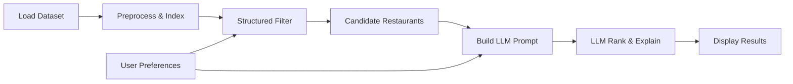

# Zomato AI Restaurant Recommendation System

## Project Context

This repository is the home for an **AI-powered restaurant recommendation service** inspired by Zomato. The goal is to help users discover restaurants that match their preferences—not by scrolling through long, static lists, but through **personalized, explainable suggestions** backed by real restaurant data and a Large Language Model (LLM).

The project sits at the intersection of three ideas:

1. **Real-world data** — a public Zomato dataset of Bangalore restaurants with ratings, cuisines, cost, reviews, and more.
2. **Structured filtering** — narrow thousands of options to a relevant shortlist using explicit user preferences.
3. **LLM reasoning** — rank and explain recommendations in natural language so results feel helpful rather than mechanical.

At the time of writing, the repository is in its **initial setup phase**: this document captures the problem definition, data context, and intended system design before implementation begins.

---

## Problem We Are Solving

Choosing where to eat is a common but surprisingly hard decision. On platforms like Zomato, users face:

- **Too many choices** — tens of thousands of listings in a single city.
- **Weak personalization** — filters (location, cuisine, price) help, but they do not explain *why* one restaurant fits better than another for a specific occasion.
- **Information overload** — ratings, reviews, dish names, and cost ranges are spread across many fields; users must mentally combine them.

Traditional recommendation approaches (pure collaborative filtering or rule-based filters) can surface relevant options but often fail to:

- Adapt to **nuanced preferences** (e.g., “family-friendly”, “quick service”, “good for a date night”).
- Provide **human-readable explanations** for each suggestion.
- Handle **trade-offs** when no restaurant perfectly matches every constraint.

**Our approach:** combine deterministic data filtering with an LLM that receives a curated subset of restaurants and user preferences, then ranks options and generates clear explanations for each recommendation.

---

## Objective

Design and implement an application that:

1. Accepts user preferences (location, budget, cuisine, minimum rating, and free-text extras).
2. Loads and preprocesses a real Zomato restaurant dataset.
3. Filters structured data to a manageable candidate set.
4. Uses an LLM to rank candidates and produce personalized, human-like explanations.
5. Presents results in a clear, user-friendly format.

---

## Data Source

| Property | Value |
|----------|-------|
| **Dataset** | [ManikaSaini/zomato-restaurant-recommendation](https://huggingface.co/datasets/ManikaSaini/zomato-restaurant-recommendation) on Hugging Face |
| **Scope** | Restaurants listed on Zomato in **Bangalore (Bengaluru)**, India |
| **Size** | ~51,717 rows, 17 columns (~574 MB) |
| **Snapshot** | Data reflects listings as of roughly **March 2019** (derived from the original Kaggle Zomato Bangalore dataset) |

### Key Fields

| Field | Description |
|-------|-------------|
| `name` | Restaurant name |
| `location` | Neighborhood / area within Bangalore |
| `address` | Full address |
| `cuisines` | Comma-separated cuisine types (e.g., North Indian, Chinese) |
| `rate` | Overall rating out of 5 (may contain missing values) |
| `votes` | Number of user votes backing the rating |
| `approx_cost(for two people)` | Approximate cost for two people |
| `rest_type` | Type of venue (e.g., Casual Dining, Quick Bites) |
| `dish_liked` | Popular dishes at the restaurant |
| `online_order` | Whether online ordering is available (Yes/No) |
| `book_table` | Whether table booking is available (Yes/No) |
| `reviews_list` | Customer reviews (rating + text) |
| `menu_item` | Menu items offered |
| `listed_in(type)` | Meal/venue category (Buffet, Cafes, Delivery, Dine-out, etc.) |
| `listed_in(city)` | City/neighborhood listing category |

### Data Considerations

- **Missing ratings:** Not all restaurants have a `rate` value; preprocessing must handle nulls.
- **String-typed numerics:** Fields like `rate` and `approx_cost(for two people)` may need parsing and normalization.
- **Multi-value fields:** `cuisines`, `dish_liked`, and `reviews_list` require careful extraction for filtering and prompt construction.
- **Geographic scope:** The dataset covers Bangalore neighborhoods only—not pan-India cities like Delhi or Mumbai unless explicitly mapped from user input.

---

## User Input

The application collects preferences such as:

| Input | Examples |
|-------|----------|
| **Location** | Banashankari, Indiranagar, Koramangala |
| **Budget** | Low / medium / high (mapped to cost ranges) |
| **Cuisine** | Italian, Chinese, North Indian |
| **Minimum rating** | e.g., 4.0+ |
| **Additional preferences** | Free-text or structured tags: family-friendly, quick service, accepts online orders, bookable tables, etc. |

---

## System Workflow

### 1. Data Ingestion

- Load the Zomato dataset from Hugging Face.
- Clean and normalize fields (ratings, costs, cuisines, locations).
- Extract fields needed for filtering and for LLM context.

### 2. Integration Layer

- Apply structured filters based on user input (location, cuisine, budget, rating threshold).
- Select a bounded set of candidate restaurants (to stay within LLM context limits).
- Build a prompt that includes user preferences and structured restaurant summaries.

### 3. Recommendation Engine (LLM)

The LLM is responsible for:

- **Ranking** filtered candidates by fit to user preferences.
- **Explaining** why each top pick matches (or noting trade-offs).
- **Summarizing** choices when helpful (e.g., “best budget option”, “highest rated”).

The LLM should not invent restaurants—it only reasons over the filtered candidate set passed in the prompt.

### 4. Output Display

Present top recommendations in a user-friendly format, including:

- Restaurant name
- Cuisine(s)
- Rating and vote count
- Estimated cost for two
- Location / neighborhood
- AI-generated explanation of why it was recommended

---

## Success Criteria

The system is successful when it can:

1. **Filter accurately** — returned candidates respect hard constraints (location, min rating, budget band, cuisine).
2. **Recommend meaningfully** — LLM rankings reflect stated preferences, including soft constraints from free-text input.
3. **Explain clearly** — each recommendation includes a concise, accurate rationale tied to dataset fields.
4. **Stay grounded** — no hallucinated restaurants, ratings, or prices; all facts come from the dataset.
5. **Perform acceptably** — end-to-end flow (filter → LLM → display) completes in reasonable time for interactive use.

---

## Scope & Constraints

**In scope**

- Bangalore restaurant data from the specified Hugging Face dataset.
- Preference-based filtering and LLM-powered ranking/explanation.
- A usable interface for entering preferences and viewing results (CLI, API, or web UI—to be decided during implementation).

**Out of scope (initial version)**

- Live Zomato API integration or real-time menu/pricing.
- User accounts, saved history, or collaborative filtering across users.
- Multi-city support beyond what exists in the dataset.
- Training a custom recommendation model from scratch (we use filtering + LLM instead).

**Technical constraints**

- LLM context window limits the number of candidates sent per request; filtering must reduce the set first.
- Dataset is a historical snapshot; listings, ratings, and costs may not reflect current Zomato data.

---

## Architecture & Implementation

- **[architecture.md](./architecture.md)** — component design, API schemas, data flow, LLM integration, deployment
- **[implementationPlan.md](./implementationPlan.md)** — phase-wise tasks, acceptance criteria, timeline (~9 days)
- **[edgecase.md](./edgecase.md)** — known edge cases and expected behavior
- **[eval/](./eval/)** — phase evaluation checklists (one `eval.md` per phase)

**Planned stack (v1):** Python, Hugging Face `datasets`, pandas, FastAPI, OpenAI-compatible LLM, Streamlit UI.

---

## References

- [architecture.md](./architecture.md) — detailed system architecture
- [implementationPlan.md](./implementationPlan.md) — phase-wise implementation plan
- [edgecase.md](./edgecase.md) — edge case catalog
- [eval/README.md](./eval/README.md) — phase evaluation guides
- [ManikaSaini/zomato-restaurant-recommendation](https://huggingface.co/datasets/ManikaSaini/zomato-restaurant-recommendation) — primary dataset
- Original source lineage: Kaggle Zomato Bangalore restaurants dataset (Himanshu Poddar)
